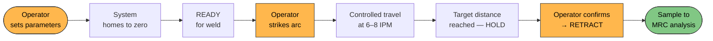
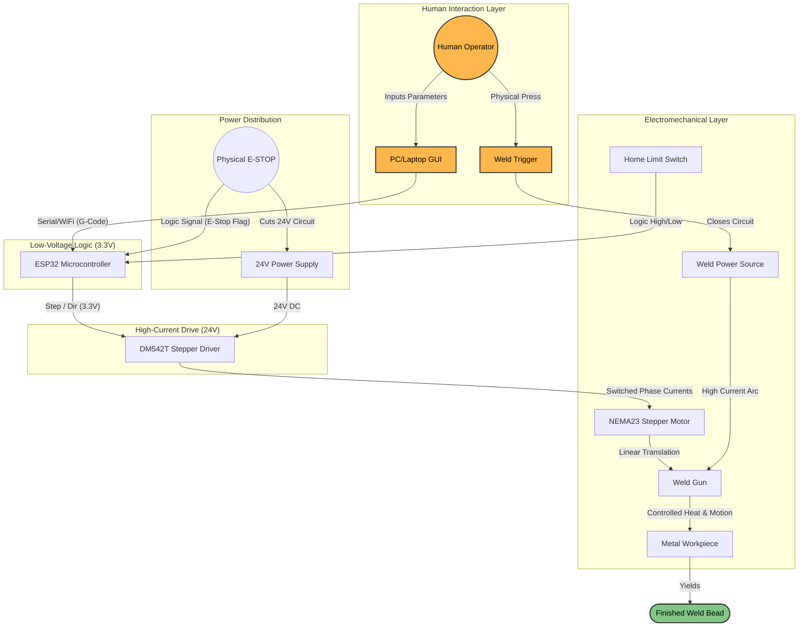
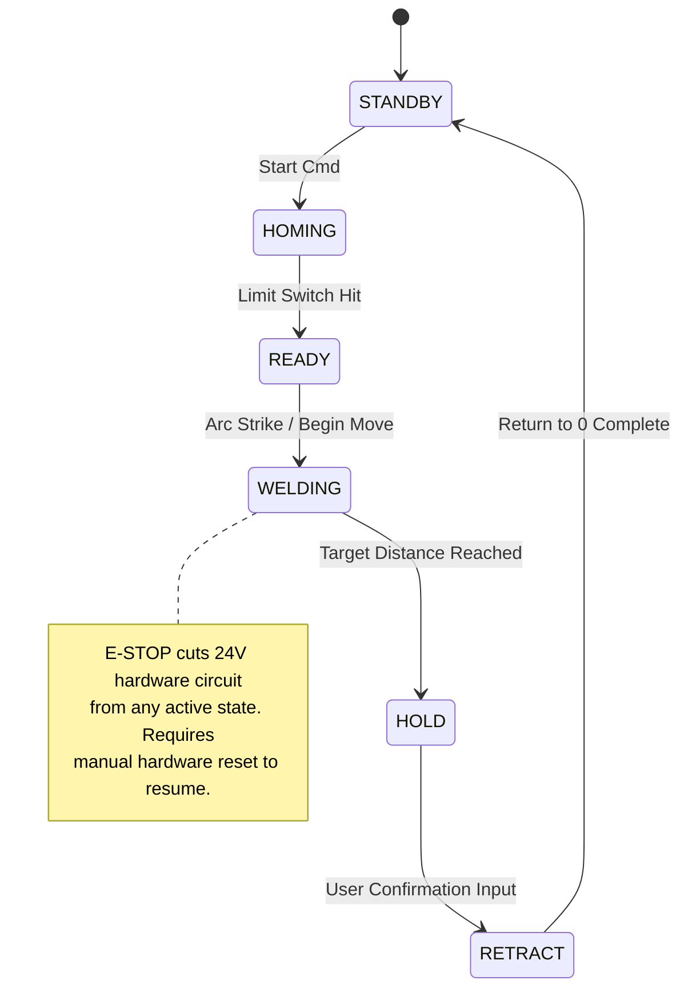
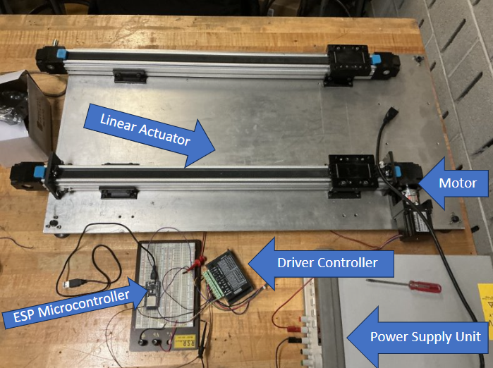
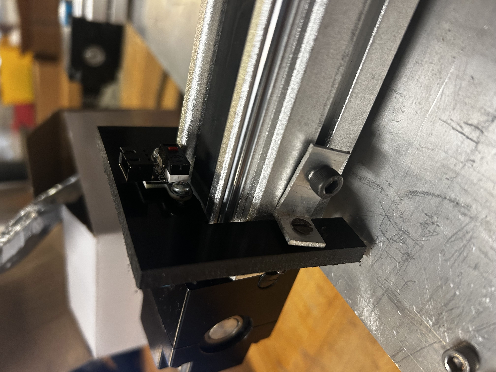
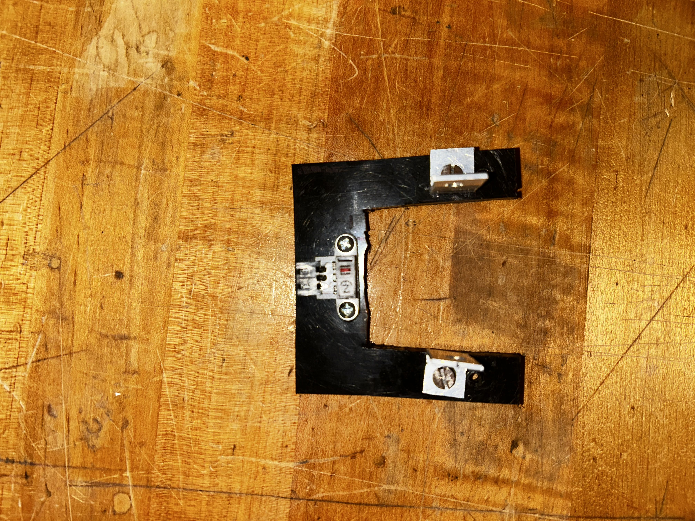

# Automated Welding Workcell - Electromechanical Subsystem (Capstone)

**Role:** Electromechanical Subsystem Lead | **Platform:** ESP32 DevKit + DM542T Stepper Driver | **Actuator:** NEMA 23 (10:1 Gearbox) + Belt Drive Linear Actuator

**Context:** Senior Capstone Project — Automated Welding Theory Lab for undergraduate welding education at RPI. Developed following the **NASA Systems Engineering Handbook (SP-2016-6105 Rev2)**.

---

## 1. Project Overview

This repository contains the embedded motion control firmware and electromechanical system architecture for an **automated weld travel system** that delivers consistent, repeatable weld beads for undergraduate metallurgical analysis.

The system replaces manual hand-welding (which introduces uncontrolled human variability in travel speed) with a deterministic linear actuator system, enabling students to isolate and study weld metallurgy rather than weld technique. My scope covers the electromechanical subsystem: drive analysis, speed derivation, microstepping configuration, state machine design, and motion control firmware.

Weld samples produced by the system undergo multi-stage analysis at the RPI Materials Research Center (MRC): macroetching, optical microscopy, and fillet weld break testing.

> **Full design rationale, trade studies, and speed derivations:** [Engineering Notebook Welding Log](https://github.com/abouzk/systems-engineering-notebook/blob/main/logs/esp32-weld-motion-controller-log.md)

---

## 2. Concept of Operations

The electromechanical subsystem occupies the **weld execution phase** of the broader lab workflow. From the operator's perspective:



*Orange = operator action. Green = system output delivered to next lab phase.*

---

## 3. Electromechanical System Architecture



---

## 4. Embedded Control State Machine



---

## 5. Driver Configuration

The actuator uses a NEMA 23 stepper with 10:1 gearbox and belt drive (pitch circumference = 72mm), requiring the motor to run at 21.2–28.2 RPM to achieve the 6–8 IPM target.

At full-step resolution (200 steps/rev), the minimum drive frequency of 70.7 Hz falls within the motor's primary mechanical resonance band, causing step loss and speed instability. Configured for 1/8 microstepping (1600 PPR) to shift the drive frequency to 565 Hz, producing smooth continuous motion across the full operational range.

| Parameter | Value |
|---|---|
| Microstepping | 1/8 (1600 PPR) |
| Drive freq range | 565–752 Hz (6–8 IPM) |
| STEP pin | GPIO 14 → PUL- |
| DIR pin | GPIO 15 → DIR- |
| ENA pin | GPIO 16 → ENA- |

---

## 6. Hardware



*Phase 2 hardware assembly -- belt drive linear actuator, NEMA 23 motor,
DM542T stepper driver, ESP32 microcontroller, and 24V PSU.*

## 7. Hardware Safety Audit (March 18, 2026)

Physical inspection of the existing linear actuator assembly identified
a safety-critical finding prior to firmware deployment.

**Finding:** The home limit switch is mounted on a thin-walled plastic
U-bracket attached to the actuator end plate. Stress fracturing was
identified at the inner bracket corners under load. Bracket detachment
during operation would result in loss of home position reference with
no hardware stop signal -- the 30-second homing timeout in firmware
(`HOMING_TIMEOUT_US`) was implemented directly in response to this finding
as a software detection layer.

**Status:** Bracket replacement or reinforcement required before live
weld testing. Non-negotiable deployment gate.

| | |
|---|---|
|  |  |
| *Limit switch bracket installed on actuator end* | *Bracket removed -- stress fracturing visible at inner corners* |

## 8. Repository Structure

```
esp32-weld-motion-controller/
├── src/
│   └── main.cpp                  # ESP32 motion control firmware
├── docs/
│   └── sketches/                 # Hand-drawn design artifacts (Phase 1)
|   └── audit/                    # Hardware safety audit photos (Phase 2)
├── media/
│   └── system_photo.jpg
└── README.md
```

---

## 9. Engineering Retrospective

**Microstepping selection:** The 70.7 Hz → 565 Hz frequency shift from full-step to 1/8 microstep was the key configuration decision. At the required 21.2 RPM motor speed, full-step resonance would have been the dominant failure mode regardless of any other tuning.

**Future iteration:** Current velocity control is open-loop (fixed pulse frequency). A future revision would close the loop with encoder feedback on the actuator output shaft, compensating for load-dependent speed variation under variable weld gun drag forces.

---

## About

**Capstone Project** — RPI MATL Department  
**My role:** Electromechanical subsystem lead — speed analysis, microstepping configuration, state machine design, motion control firmware  
**Collaborators:** GUI/frontend (teammate), wiring schematic (teammate)  
**Methodology:** NASA Systems Engineering Handbook SP-2016-6105 Rev2
